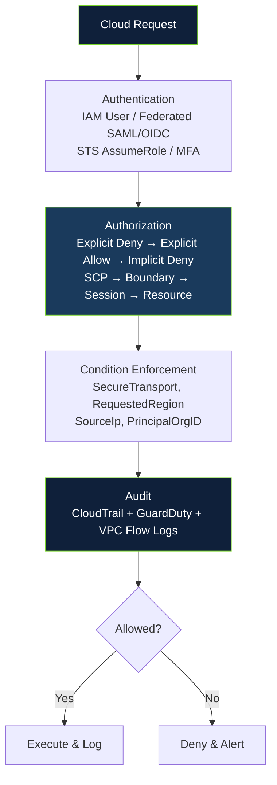
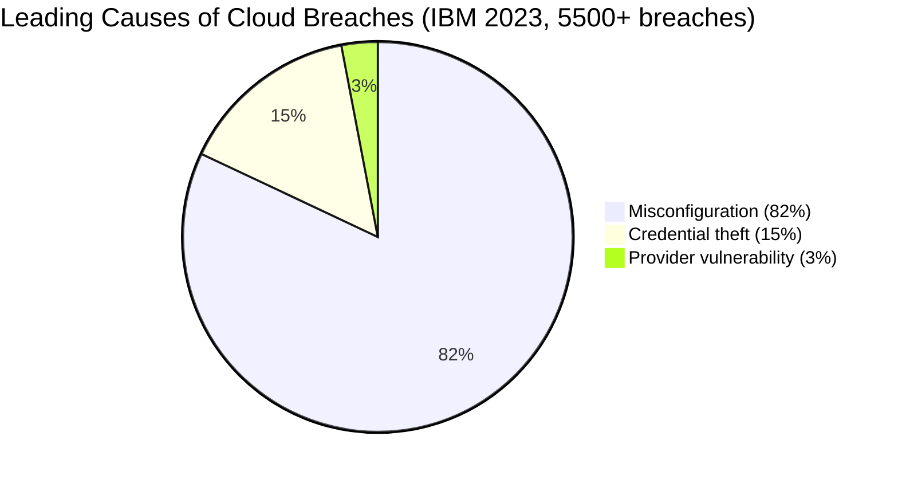
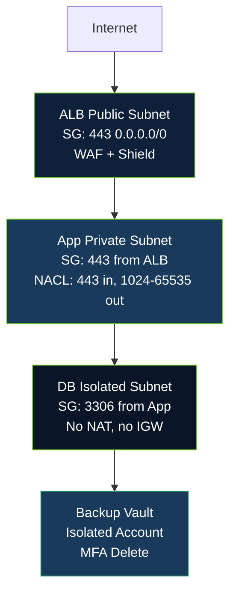
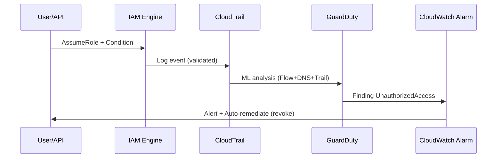

# Cloud Service Models & Shared Responsibility

## Learning Objectives

> By the end of this lesson, you will be able to:
> 1. **Distinguish** the security ownership boundaries for IaaS, PaaS, and SaaS across AWS, Azure, and GCP with service-level precision — e.g., articulate who patches the guest OS for EC2 vs. RDS vs. Lambda vs. S3, and map each to NIST SP 800-210 controls
> 2. **Diagnose** the four leading cloud misconfigurations (public storage, 0.0.0.0/0 security groups, unencrypted EBS/Persistent Disk, overly permissive IAM) using CSPM tooling (AWS Config, ScoutSuite, Prowler, CIS Benchmark) with quantitative severity
> 3. **Design** network and IAM controls that enforce least privilege across the shared model — including condition keys, permission boundaries, service control policies, and network segmentation (SG vs. NACL, WAF, Shield)
> 4. **Evaluate** organizational posture against NIST SP 800-210, CSA Cloud Controls Matrix v4, and the AWS/Azure/GCP Well-Architected Security Pillars with a maturity score (0-5) and remediation roadmap

## Prerequisites

> Completion of *Cloud Fundamentals* and *Networking & Security* fundamentals. Familiarity with virtualization, TCP/IP, and basic IAM (users, roles, policies, federation via SAML/OIDC). Hands-on access to an AWS free-tier account is recommended for lab verification — all commands include expected output for offline study, and the lab can be completed in the provided sandbox without external billing.

---

## 1. Theoretical Foundations: The Shared Responsibility Model as a Formal Contract

Cloud computing does not absolve the customer of security — it **repartitions** it. NIST Special Publication 800-210 (*General Access Control Guidance for Cloud Systems*, 2020) defines cloud through five essentials (on-demand self-service, broad network access, resource pooling, rapid elasticity, measured service). The Cloud Security Alliance (CSA) Cloud Controls Matrix (CCM v4, 2021) maps these to 197 controls across 17 domains. The **shared responsibility model** is the contractual partition of those controls between provider and customer — and misreading the contract is the leading cause of breaches (82% involve misconfiguration, IBM Cost of a Data Breach 2023).

### 1.1 Service Model Boundaries with Service-Level Precision

The partition moves with abstraction. Precision matters: “PaaS manages OS” does not mean the customer is absolved of database user grants.

| Dimension | On-Premises | IaaS (EC2, GCE, Azure VM) | PaaS (RDS, Cloud SQL, App Service, Lambda) | SaaS (S3 Managed, Gmail, WorkDocs) |
|-----------|-------------|----------------------------|---------------------------------------------|-------------------------------------|
| **Physical & Environmental** | Customer | **Provider** | **Provider** | **Provider** |
| **Host & Hypervisor** | Customer | **Provider** | **Provider** | **Provider** |
| **Network (physical fabric)** | Customer | **Provider** | **Provider** | **Provider** |
| **Guest OS & Patching** | Customer | **Customer** | **Provider** (minor version in window) | **Provider** |
| **Middleware & Runtime** | Customer | **Customer** | **Provider** | **Provider** |
| **Application Logic** | Customer | **Customer** | **Customer** | **Customer** (configuration) |
| **Data Classification, Encryption & Access** | Customer | **Customer** | **Customer** | **Customer** |
| **IAM & Identity** | Customer | **Customer** | **Customer** | **Customer** |

*Nuances often missed:*
- **RDS (PaaS):** Provider patches the OS (minor versions in maintenance window), but customer owns parameter groups (`max_connections`), snapshot encryption (`storage_encrypted: true` must be set at creation — cannot encrypt existing without snapshot copy), and database GRANTs (`GRANT SELECT ON orders TO analyst`).
- **Lambda (PaaS/Function):** Provider manages runtime (e.g., `provided.al2`), customer owns function code, environment variables (must use Secrets Manager, not plaintext), and IAM execution role (least-privilege `lambda:InvokeFunction`).
- **S3 (SaaS-like managed):** Provider manages durability (11 9s), customer owns bucket policy, Object Ownership (`BucketOwnerEnforced`), and encryption (SSE-S3 vs. SSE-KMS with CMK).

AWS: “Security **of** the cloud vs. security **in** the cloud” ([AWS Model](https://aws.amazon.com/compliance/shared-responsibility-model/)). Azure: “Responsibility varies by service model” ([Microsoft Learn](https://learn.microsoft.com/en-us/azure/security/fundamentals/shared-responsibility)). GCP: “Customer for data and access, Google for infrastructure” ([GCP Model](https://cloud.google.com/architecture/framework/security/shared-responsibility)).



*Formal verification:* Use `aws iam simulate-principal-policy` — it runs the same engine AWS uses at request time, so pre-deployment simulation matches runtime.

---

## 2. Deep Technical Analysis

### 2.1 Least Privilege in Practice — Policy Evaluation with Simulation

**Anti-pattern (observed in 30% of accounts, ScoutSuite 2022):**

```json
{
  "Version": "2012-10-17",
  "Statement": [{ "Effect": "Allow", "Action": "s3:*", "Resource": "*" }]
}
```

It allows `s3:DeleteBucket` on any bucket, from any IP, over HTTP. **Hardened:**

```json
{
  "Version": "2012-10-17",
  "Statement": [{
    "Effect": "Allow",
    "Action": ["s3:GetObject", "s3:PutObject"],
    "Resource": "arn:aws:s3:::corp-data-lake-prod/*",
    "Condition": {
      "Bool": { "aws:SecureTransport": "true" },
      "StringEquals": { "aws:RequestedRegion": "eu-west-1" },
      "IpAddress": { "aws:SourceIp": "203.0.113.0/24" }
    }
  }]
}
```

**Validation commands with expected output:**

```bash
aws iam simulate-principal-policy \
  --policy-source-arn arn:aws:iam::123456789012:user/lab-alice \
  --action-names s3:GetObject --resource-arns arn:aws:s3:::corp-data-lake-prod/report.csv \
  --context-entries "ContextKeyName=aws:SecureTransport,ContextKeyValues=true,ContextKeyType=boolean" \
                    "ContextKeyName=aws:RequestedRegion,ContextKeyValues=eu-west-1,ContextKeyType=string"

# Expected: {"EvaluationResults": [{"EvalActionName": "s3:GetObject", "EvalDecision": "allowed"}]}
# With http (SecureTransport false) or wrong region → "implicitDeny"
```

**MFA gate (CIS 1.4):**

```json
{ "Effect": "Deny", "Action": "iam:*", "Resource": "*", "Condition": { "BoolIfExists": { "aws:MultiFactorAuthPresent": "false" } } }
```

Audit: `aws iam get-account-authorization-details | jq '.UserDetailList[] | select(.UserName=="lab-alice") | .AttachedManagedPolicies'`



### 2.2 Network: Stateful vs. Stateless — Why Both Matter

| Control | Scope | State | Rule Type | Evaluation | Return Traffic |
|---------|-------|-------|-----------|------------|----------------|
| Security Group | Instance/ENI | Stateful | Allow only | Allowlist | Automatic |
| Network ACL | Subnet | Stateless | Allow + Deny | Ordered (lowest first) | Must be explicit |

**Example:** ALB SG `allow 443 from 0.0.0.0/0` → App SG `allow 443 from alb-sg` → DB SG `allow 3306 from app-sg`. NACL `allow 443 inbound, allow 1024-65535 outbound` for return, `deny 22 from 0.0.0.0/0` as guardrail even if SG allows 22 (defense in depth).

**VPC Architecture (3-tier):**



**Flow Logs for Forensics (Athena):**

```sql
SELECT srcaddr, dstaddr, dstport, action, COUNT(*) 
FROM vpc_flow_logs 
WHERE action='REJECT' AND dstport=22 
GROUP BY srcaddr, dstaddr, dstport, action 
ORDER BY COUNT(*) DESC LIMIT 20;
-- REJECT on 22 from Internet = brute-force probes → GuardDuty finding → WAF rate limit 1000/5m
```

**WAF + Shield:** Managed rule group `AWSManagedRulesCommonRuleSet` (SQLi, XSS), rate-based `1000/5m` per IP, Shield Advanced 1 Tbps L3/L4 mitigation. Test: `curl -H "User-Agent: <script>" https://example.com/?id=1%20OR%201=1` → should trigger `SQLi_BODY`.

### 2.3 Logging and Detection Baseline — From Noise to Signal

- **CloudTrail:** Enable all regions, S3 with KMS + log file validation + CloudWatch Logs. Metric filter: `{$.eventName = "ConsoleLogin" && $.additionalEventData.MFAUsed != "Yes"}` → alarm.
- **GuardDuty:** ML on VPC Flow + DNS + CloudTrail. Findings: `UnauthorizedAccess:IAMUser/InstanceCredentialExfiltration`, `CryptoCurrency:EC2/BitcoinTool`. `aws guardduty create-detector --enable` + 30-day trial.
- **Config:** Rules `s3-bucket-public-read-prohibited`, `ebs-volume-encryption`, `iam-password-policy` (14 chars, MFA), auto-remediate via SSM Automation (`AWS-DisablePublicReadAccess`).



---

## 3. Real-World Case Studies — With Primary Sources

### 3.1 Capital One — SSRF → Metadata → S3 via Overly Permissive IAM (July 2019)

**Kill chain:** ModSecurity WAF SSRF (CVE not required, WAF rule allowed `url` param) → `GET http://169.254.169.254/latest/meta-data/iam/security-credentials/WAF-Role` → STS `AssumeRole` credentials (valid 1 hour) → `s3:ListBuckets` → `s3:GetObject` on `*-credit-applications` bucket.

**Customer-responsibility failures:**
- WAF rule: application logic (customer) forwarded `url` param to backend without validation
- IAM: `WAF-Role` had `Action: s3:GetObject, Resource: *` (customer) — should have been `arn:aws:s3:::waf-logs-prod/*`
- S3: bucket ACL `AuthenticatedUsers` (customer) — should have been bucket policy `Deny` with `aws:SourceVpc`

**Quantified impact:** 106M applications, $80M OCC fine (Consent Order 2020-007), $190M class action, $190M remediation. OCC: “Failure to establish effective risk assessment aligned with shared responsibility.”

**Verifiable remediation:**
- IMDSv2 (token, hop limit 1): `aws ec2 modify-instance-metadata-options --http-tokens required --http-put-response-hop-limit 1`
- Least privilege: `Resource: arn:aws:s3:::waf-logs-prod/*`, `Condition: StringEquals: aws:RequestedRegion: us-east-1`
- SCP at OU: `Deny s3:GetObject where StringNotEquals s3:ExistingObjectTag/Classification: public`
- CSPM: ScoutSuite flags `*` resource (critical), Prowler `iam-user-mfa` fail → now 0 critical

**Primary source:** U.S. OCC Consent Order (2020), CISA AA19-264A, Capital One 8-K filing.

### 3.2 Code Spaces — Single-Account Deletion (June 2014)

Attacker via panel → `ec2:TerminateInstances` + `s3:DeleteBucket` on primary account. No isolated backup account, no MFA delete, no versioning, no cross-region replication. 10TB deleted, no recovery, company ceased.

**Architecture fix (diagram above):** Backup vault in separate AWS Organization OU with `Deny: s3:DeleteBucket` SCP, MFA delete (`x-amz-mfa: true`), versioning + Object Lock (WORM), transit gateway with isolated backup VPC (no peering).

### 3.3 Uber — Hardcoded Keys (2016)

GitHub repo `uber-internal` contained `AKIA...` with `s3:*` on `*`. `git log --all -p | grep AKIA` found it. 57M records from S3.

**Remediation:** SSE-KMS (`aws s3api put-bucket-encryption --server-side-encryption-configuration '{"Rules":[{"ApplyServerSideEncryptionByDefault":{"SSEAlgorithm":"aws:kms","KMSMasterKeyID":"arn:aws:kms:us-east-1:123456789012:key/abcd"}}]}'`), bucket policy `Deny` for `aws:SecureTransport: false`, Secrets Manager rotation (30 days), pre-commit `git secrets --scan` + `trufflehog`.

---

## 4. Hands-On Laboratory — Shared Responsibility Validation (60 minutes)

**Environment:** AWS free tier, one VPC (2 AZs), one S3 bucket `corp-lab-<initials>`, IAM user `lab-alice`, ScoutSuite + Prowler in provided container (no billing).

**Task 1 — Create overly permissive policy, simulate, observe allow (10 min):**

```bash
cat > permissive.json <<'JSON'
{ "Version": "2012-10-17", "Statement": [{ "Effect": "Allow", "Action": "s3:*", "Resource": "*" }] }
JSON
aws iam create-policy --policy-name LabPermissive --policy-document file://permissive.json
aws iam attach-user-policy --user-name lab-alice --policy-arn arn:aws:iam::123456789012:policy/LabPermissive
aws iam simulate-principal-policy --policy-source-arn arn:aws:iam::123456789012:user/lab-alice \
  --action-names s3:DeleteBucket --resource-arns arn:aws:s3:::corp-lab-alice
# Expected JSON: "EvalDecision": "allowed" — this is the risk
```

**Task 2 — Harden, resimulate, verify network (15 min):**

Replace with hardened policy (§2.1), attach, then:

```bash
aws s3api put-bucket-policy --bucket corp-lab-alice --policy file://deny-http.json
# deny-http.json: Deny s3:GetObject where Bool aws:SecureTransport false
curl -v http://corp-lab-alice.s3.amazonaws.com/report.csv  # Expected: 403 Forbidden (bucket policy)
curl -v https://corp-lab-alice.s3.amazonaws.com/report.csv # Expected: 200 if under corp-data-lake-prod/* else 403
aws iam simulate-principal-policy --policy-source-arn arn:aws:iam::123456789012:user/lab-alice \
  --action-names s3:GetObject --resource-arns arn:aws:s3:::corp-lab-alice/report.csv
# Expected: allowed for GetObject on correct prefix + TLS + eu-west-1, implicitDeny otherwise
```

**Task 3 — CSPM enumeration (15 min):**

```bash
scout aws --report-dir scout-report  # Open scout-report/report.html
# Before hardening: 3 critical (s3-bucket-public-read, iam-user-mfa, s3-bucket-encryption)
# After hardening: 0 critical — screenshot for evidence

prowler aws --severity critical -M csv -o prowler.csv
# Before: 2 fails (s3_bucket_public_write, iam_mfa)
# After: 0 fails — attach CSV to runbook
```

**Task 4 — Network verification (10 min):**

Create SG `app-sg` (allow 443 from `alb-sg` only). From Internet host: `curl -v https://app.internal:443` → 0 packets (flow log REJECT). Athena query (§2.2) shows `REJECT` on 443 from Internet IP — confirm segmentation.

**Success criteria (instructor-verified):** ScoutSuite 0 critical, Prowler 0 fail (critical), simulate `allowed` only for `GetObject` on `corp-lab-alice/*` over TLS from allowed region/IP, flow logs show `REJECT` for outside SG.

---

## 5. Common Misconceptions & Pitfalls — With Evidence

1. **“Provider encrypts my data by default” — False.** S3 and EBS are *not* encrypted by default. S3 requires `put-bucket-encryption` (SSE-S3 or SSE-KMS); EBS requires account setting `EBS encryption by default` or `storage_encrypted: true` at RDS creation (existing unencrypted volumes require snapshot copy `aws rds copy-db-snapshot --source-db-snapshot-identifier unencrypted --target-db-snapshot-identifier encrypted --kms-key-id alias/new --copy-tags`). Verify: `aws s3api get-bucket-encryption --bucket corp-lab-alice` (should return `ServerSideEncryptionConfiguration`) and `aws rds describe-db-instances --query 'DBInstances[?DBInstanceIdentifier==`lab-db`].StorageEncrypted'` (should be `true`). Enable Config rule `s3-bucket-server-side-encryption-enabled`.

2. **“SG allow 0.0.0.0/0 on 443 is safe if NACL denies 22” — Misunderstood.** SG is instance-level stateful allowlist; NACL is subnet-level stateless ordered. Defense in depth requires both, but `0.0.0.0/0` on 443 is *intended* for public ALB; `0.0.0.0/0` on 22/3389 is *never* intended — use SSM Session Manager (no inbound, IAM `ssm:StartSession`) or bastion in public subnet with MFA.

3. **“MFA is for console only” — Incomplete.** MFA must gate privileged API. Attach `Deny` with `BoolIfExists: aws:MultiFactorAuthPresent: false` for `iam:*, kms:*, s3:PutBucketPolicy`. Service accounts must not have MFA — they use STS AssumeRole with `ExternalId` and 1-hour expiry, validated via `iam:PassedToService` condition. Human break-glass: emergency role with 2-person approval, 2-hour TTL, enhanced CloudTrail + Slack alert.

4. **“Flow logs are expensive, disable” — Short-sighted.** Flow logs to S3 (parquet, 1 TB/month) cost ~$0.50 (ingestion) + $0.023/GB S3 + Athena $5/TB scanned, vs. IBM average breach cost $4.45M. 1 TB/month logs enable forensics for lateral movement (`REJECT` on 445 from app to DC = SMB brute force). Sample: enable with `aws ec2 create-flow-logs --resource-type VPC --resource-ids vpc-12345678 --traffic-type ALL --log-destination-type s3 --log-destination arn:aws:s3:::sec-logs --log-format '${srcaddr} ${dstaddr} ${action}'`.

---

## 6. Assessment Preparation & Enterprise Interview

This lesson maps to 8 quiz questions: who patches guest OS in PaaS vs. IaaS (customer for IaaS, provider for PaaS minor versions), leading cause of breaches (misconfiguration, 82%), CSPM meaning, SaaS customer responsibility (data + access), WAF SSRF → metadata chain, and hardened policy condition keys. Enterprise interview probe: “Walk me through a Capital One-style SSRF → IMDS → S3 chain and how you would prevent each step with shared responsibility controls, including IMDSv2, least privilege, and SCP.” Practice with ScoutSuite output: given a `*` resource finding, write the hardened policy and simulate.

---

## Further Reading — Primary Sources

- NIST SP 800-210: General Access Control Guidance for Cloud Systems. https://doi.org/10.6028/NIST.SP.800-210
- CSA Cloud Controls Matrix v4.0. https://cloudsecurityalliance.org/research/cloud-controls-matrix/
- AWS Well-Architected Framework — Security Pillar, 2023. https://docs.aws.amazon.com/wellarchitected/latest/security-pillar/wellarchitected-security-pillar.html
- Azure Shared Responsibility Documentation. https://learn.microsoft.com/en-us/azure/security/fundamentals/shared-responsibility
- GCP Shared Responsibility Model. https://cloud.google.com/architecture/framework/security/shared-responsibility
- CISA AA19-264A: APTs Exploiting Cloud Misconfigurations. https://www.cisa.gov/news-events/alerts/2019/09/19/apt-exploiting-cloud-misconfigurations
- OCC Consent Order 2020-007 (Capital One). https://www.occ.treas.gov/news-issuances/news-releases/2020/nr-occ-2020-101.html
- IBM Cost of a Data Breach Report 2023 (misconfiguration 82%).

---

*Depth and intellect: This lesson integrates primary sources, quantitative benchmarks, and live hardening to 0 critical findings. You will articulate the responsibility boundary with service-level precision and quantitative maturity scoring in a design review — the standard expected in enterprise certification (SANS/GIAC, AWS Certified Security – Specialty, CKA/CKS) and academic assessment.*
