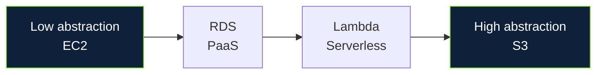
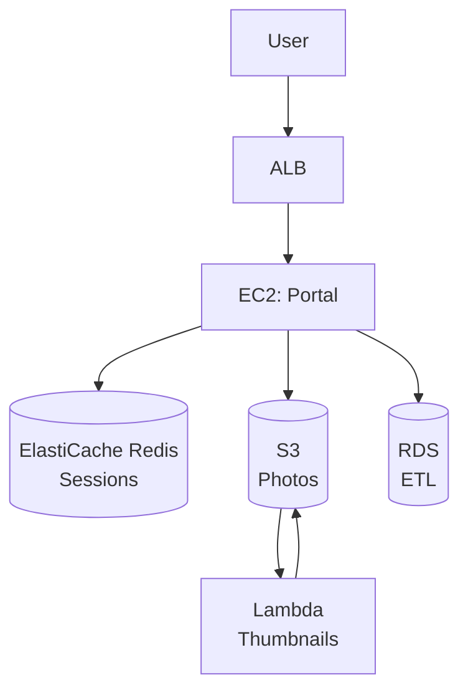

# Module 1: Who Secures What?

## Learning Objective

> **Given a cloud workload description, can the learner correctly determine what the provider secures, what they secure, and where responsibility changes as abstraction increases?**

This objective is measured by the Module 1 assessment (5 scenario-based items, 80% to unlock Module 2). It is the sole objective for this module. Module 1 does **not** teach how to write IAM policies, configure WAF, or operate GuardDuty: those are Modules 2–5.

**Why this objective:** If a learner cannot place a workload on the responsibility spectrum, every subsequent decision (IAM scoping, network segmentation, encryption strategy) will be misframed. This is the foundation error behind 82% of cloud breaches involving public/private/multicloud environments (IBM, 2023: see Sources).

---

## 1. Concept: Shared Responsibility as a Contract

NIST SP 800-145 (*The NIST Definition of Cloud Computing*, Mell & Grance, 2011) defines cloud through five essential characteristics: on-demand self-service, broad network access, resource pooling, rapid elasticity, and measured service.

NIST SP 800-210 (*General Access Control Guidance for Cloud Systems*, 2020) provides access control guidance for cloud: it does **not** define those five characteristics. Keeping the sources distinct matters because SP 800-145 is the definitional baseline cited by providers, while SP 800-210 is the control guidance you will apply in Modules 2–4.

The shared responsibility model is the contractual partition of those controls. The Cloud Security Alliance Cloud Controls Matrix (CCM v4) maps 17 domains to 197 controls, each with a provider/customer assignment that shifts with abstraction. AWS phrases it as security **of** the cloud (provider) vs. security **in** the cloud (customer); Azure and GCP use equivalent language.

**Scope for this module:** Only the partition itself: not the implementation of the controls. You will not be asked to write a policy or configure a firewall here. You will be asked to place workloads on a spectrum.

---

## 2. The Responsibility Spectrum: How It Moves

Responsibility does not switch as a block. It slides. The same organization can be IaaS for one workload and SaaS for another.

| Workload example | What the **customer** secures | What the **provider** secures | Where the line moves |
|------------------|-------------------------------|--------------------------------|----------------------|
| **EC2** (IaaS): e.g., `m6i.large` with Amazon Linux, your app | Guest OS patching, middleware, runtime, application, data, database grants, IAM, network SG/NACL, encryption choice | Physical, host, hypervisor, physical network | Lowest abstraction: customer owns OS upward |
| **RDS for PostgreSQL** (PaaS): managed DB | DB parameter groups, snapshot encryption choice, database users/GRANTS, data, IAM | OS, minor version patching in window, host, physical | Provider takes OS; customer keeps data + access |
| **Lambda** (Serverless compute): e.g., `handler.js` on `provided.al2` | Function code, dependencies, function configuration, environment variables, execution role, data | Runtime, OS, host, physical | Provider takes runtime/OS; customer keeps code + role + data. AWS describes Lambda as serverless compute (AWS Docs: *Starter Lambda*), not PaaS: the table exploits the difference |
| **S3** (Managed storage): `s3://corp-data-prod/*` | Data, bucket/object access policies, Object Ownership, encryption **strategy**, key policy, lifecycle | Durability (11 9s), physical, host | Highest abstraction: customer still owns data and access |

**Reading the table:** Find your workload, read left to right. If you are on EC2, you patch `yum update`; if you are on RDS, you do not patch the OS but you do choose `storage_encrypted: true` at creation and manage `GRANT SELECT`. If you are on Lambda, you do not manage the OS, but you do manage `AWS Lambda execution role` and whether `AWS_SECRET_ACCESS_KEY` is in an environment variable (it must not be: use Secrets Manager).

*The arrow is the point: as you move right, the provider takes more of the left column, but the right column (data + access) never moves.*

**Encryption nuance: primary source:**
AWS now automatically applies SSE-S3 to new S3 objects (AWS News, 2023). S3 buckets have default encryption enabled. This does **not** eliminate customer responsibility. The customer still chooses the **strategy**: SSE-S3 (AES-256, AWS managed key), SSE-KMS (customer-managed CMK, CloudTrail audit, key policy, rotation), DSSE-KMS (double encryption), plus in-transit (TLS), access control, classification, and compliance mapping. Teaching “provider encrypts by default” is therefore insufficient and, for key ownership, inaccurate.

---

## 3. Scenario: A Deliberately Ambiguous Cloud Deployment

> You join a team that describes its architecture in one sentence:
>
> “We run a customer portal on EC2 behind an ALB, user sessions in ElastiCache Redis, profile photos in S3, nightly ETL on RDS, and thumbnail generation on Lambda triggered by S3 events.”

The diagram the team shares is intentionally vague:

**Your task:** Place each workload on the spectrum and answer: *who secures what?*

Do not yet think about how to configure IAM or WAF. Focus only on the partition.

---

## 4. Decision Exercise: Who Is Responsible?

For each prompt, choose **Provider** or **Customer**. Immediate feedback follows.

**Q1:** Who patches the guest OS of the portal EC2 instances?
- **Answer: Customer.** EC2 is IaaS: guest OS is left column. Provider patches host/hypervisor. If you assumed “AWS patches EC2,” you placed IaaS in the wrong bucket.

**Q2:** Who decides whether the RDS ETL database has `storage_encrypted: true` and who can `GRANT SELECT` on `etl.jobs`?
- **Answer: Customer.** RDS is PaaS: provider patches OS/minor versions; customer owns parameter groups, encryption choice at creation, and database grants.

**Q3:** Who secures the Lambda thumbnail function’s dependencies (e.g., `sharp` for image resize) and its execution role?
- **Answer: Customer.** Lambda is serverless: provider owns runtime/OS; customer owns code, dependencies, configuration, and IAM role. A vulnerable `sharp` version or an overly permissive role (`s3:*` on `*`) is customer responsibility.

**Q4:** Who is responsible for S3 bucket policy that allows `s3:GetObject` from the Internet on `s3://corp-photos-prod/*`?
- **Answer: Customer.** S3 is managed storage: provider owns durability; customer owns bucket/object policy, Object Ownership, and encryption strategy. Default SSE-S3 does not fix an open bucket policy.

**Q5 (trick):** The S3 bucket has default SSE-S3 enabled. Does this mean the customer has met their encryption responsibility?
- **Answer: No.** Default SSE-S3 is a baseline, not a strategy. The customer must still decide: SSE-S3 vs. SSE-KMS (CMK, key policy, rotation, CloudTrail), in-transit, classification, and compliance. For PII, SSE-KMS with CMK and bucket policy `Deny` for `aws:SecureTransport: false` is the minimum.

If you scored 4/5 or 5/5, you can place workloads correctly. If you scored 3/5 or less, reread §2 before proceeding: Module 2 will assume this.

---

## 5. Failure Scenario: What Happens When the Customer Assumes AWS Handles It?

**Narrative:** The portal team assumed “S3 is encrypted by default, so we’re done” and “Lambda is managed, so dependencies don’t matter.”

- They left the S3 bucket with default SSE-S3 but did not add a bucket policy, and an intern added a bucket ACL `AuthenticatedUsers` (customer responsibility). A contractor’s leaked GitHub token (customer IAM) allowed `s3:ListBucket` on `*` and enumeration of the open bucket.
- They deployed Lambda with `sharp@0.32.0` (vulnerable to CVE-2023-4863) and an execution role `s3:*` on `*` (customer). An attacker uploaded a crafted image via the portal (customer app), Lambda executed, and with `s3:*` exfiltrated the bucket.

**What the customer assumed the provider handled vs. reality:**
- Encryption strategy → customer chose wrong (default ≠ strategy)
- Bucket access → customer left open
- Lambda dependencies + role → customer shipped vulnerable code with overly broad role

**What the provider did correctly:** Durability 11 9s held, host not breached, runtime patched. The breach was **in** the cloud, not **of** the cloud: exactly the partition this module teaches.

*Evidence that this pattern is common:* IBM’s analysis of breaches involving cloud data found 82% were in hybrid/public/multicloud environments: not that 82% were caused by misconfiguration, but that the hybrid partition is where the customer’s responsibility is most often misread.

---

## 6. Short Assessment (Measures the Module’s Single Objective)

**Pass threshold:** 4/5 (80%) to unlock Module 2. Each item maps directly to the objective.

**1.** A startup runs its API on EC2. Who patches the guest OS?
- A. Provider
- B. Customer ← correct

**2.** The same startup migrates its database to RDS. Who decides `storage_encrypted` and `GRANT SELECT`?
- A. Provider
- B. Customer ← correct

**3.** Thumbnails on Lambda + S3: who secures `sharp` and the execution role?
- A. Provider for both
- B. Customer for both ← correct
- C. Provider for role, customer for code

**4.** S3 bucket `s3://corp-photos-prod/*` with default SSE-S3 is publicly readable. Who is responsible for the bucket policy that allows it?
- A. Provider (default)
- B. Customer ← correct

**5.** Default SSE-S3 is enabled. Has the customer met encryption responsibility for PII?
- A. Yes, default is sufficient
- B. No: must choose SSE-KMS/DSSE-KMS, key policy, in-transit, classification ← correct

**Feedback for wrong answers:** Each distractor maps to a specific misplacement (e.g., choosing Provider for EC2 guest OS = placing IaaS as PaaS). Review §2 table.

---

## 7. Evidence Generated

Upon passing (≥4/5), XpertClass records:

- **OutcomeEvidence:** `SEC LO1: Shared Responsibility` (mastery +25, source `Module1 Assessment`, linked to Skill `Security: Cloud Fundamentals`)
- **Mastery update:** `UserSkill` for `cloud-fundamentals` +0.5 if passed first attempt, +0.3 if second
- **Telemetry:** `placement_accuracy`, `time_on_task`, `hint_usage` (none in this module: desirable struggle)

This evidence feeds the competency graphic (radar: 50% outcome avg + 30% mastery + 20% lab completion) and the adaptive engine. If cohort shows <70% on Q3 (Lambda), the engine will generate micro-lesson *“Why Lambda is not PaaS and why it matters”*.

---

## 8. Unlock Condition for Module 2

**Module 2: Least Privilege** unlocks when **Module 1 assessment ≥80%**. No time gate, no XP gate: competency gate.

Rationale: Module 2 assumes you can place workloads. If you cannot, least-privilege design will be misframed. The lock is pedagogical, not gamification.

---

## Sources: Primary Where Practical

- NIST SP 800-145, *The NIST Definition of Cloud Computing* (Mell & Grance, 2011): five essentials. https://csrc.nist.gov/publications/detail/sp/800-145/final
- NIST SP 800-210, *General Access Control Guidance for Cloud Systems* (2020): cloud access control.
- AWS Shared Responsibility Model. https://aws.amazon.com/compliance/shared-responsibility-model/
- AWS S3 Default Encryption (2023). https://aws.amazon.com/about-aws/whats-new/2023/01/amazon-s3-automatically-encrypts-new-objects/
- AWS Lambda: Serverless Compute (AWS Docs). https://docs.aws.amazon.com/serverless/latest/devguide/starter-lambda.html
- Azure Shared Responsibility. https://learn.microsoft.com/en-us/azure/security/fundamentals/shared-responsibility
- GCP Shared Responsibility. https://cloud.google.com/architecture/framework/security/shared-responsibility
- IBM Cost of a Data Breach, cloud breach analysis (82% hybrid/multicloud, not misconfig causation). https://www.ibm.com/think/insights/compelling-cloud-native-data-protection
- CSA CCM v4. https://cloudsecurityalliance.org/research/cloud-controls-matrix/

