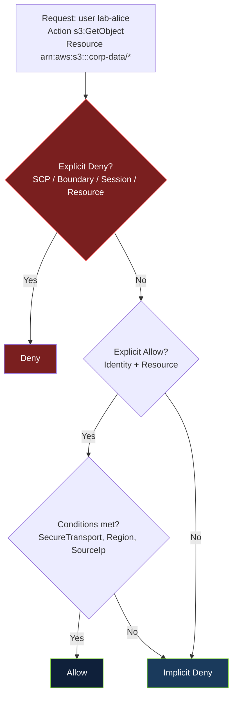
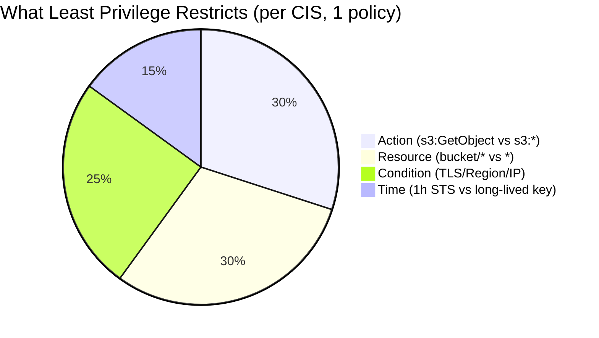

# Module 2 — Least Privilege

**Course:** Cloud Security Engineering | **Path:** Cloud Security (2 of 8) | **Status:** DRAFT → FACT_CHECK → TECHNICAL_REVIEW → PUBLISHED
**Estimated time:** 20 min theory + 15 min IAM lab + 10 min assessment | **Prerequisite:** Module 1 — Who Secures What? (≥80%)

---

## Learning Objective

> **Given a cloud permission requirement, can the learner write a policy that grants exactly what is needed — no more — and predict whether a request will be allowed or denied?**

This is the sole objective. Module 2 does **not** teach network segmentation, WAF, or detection — those are Modules 3–4. It teaches the decision: *what is the minimum permission that still works?*

Pass threshold: 8/10 to unlock Module 3. Evidence: `SEC-LO2 — Least Privilege`.

---

## 1. Concept: Least Privilege as Deny by Default

NIST SP 800-210 (General Access Control Guidance for Cloud Systems) defines least privilege as: every subject should have the minimum privileges necessary to complete its task, for the minimum time. In AWS, this is implemented as **deny by default, then allow explicitly, then deny explicitly overrides**.

The evaluation order is not a suggestion — it is the engine:



Key sources:
- NIST SP 800-210, Section 4.2 — Least Privilege in Cloud
- AWS IAM Policy Evaluation Logic (https://docs.aws.amazon.com/IAM/latest/UserGuide/reference_policies_evaluation-logic.html) — explicit deny → explicit allow → implicit deny
- CIS AWS Foundations Benchmark 1.16 — *Ensure IAM policies do not allow full administrative privileges*

**Scope for this module:** Only identity and resource policies, condition keys, and evaluation. No VPC, no WAF.

---

## 2. The Spectrum — From Overly Permissive to Least Privilege

| Approach | Policy | Blast Radius | Verifiable |
|----------|--------|--------------|------------|
| **Overly permissive** | `Action: s3:* , Resource: *` | Any bucket, any action, from any network, over HTTP — includes `DeleteBucket` | `simulate` → allowed for `DeleteBucket` |
| **Scoped but no conditions** | `Action: GetObject/PutObject , Resource: arn:aws:s3:::corp-data/*` | Only that bucket, but from any network, over HTTP | `simulate` → allowed over HTTP (should be deny) |
| **Least privilege** | `Action: GetObject, Resource: arn:aws:s3:::corp-data/* , Condition: SecureTransport true + RequestedRegion eu-west-1 + SourceIp 203.0.113.0/24` | Only that prefix, only TLS, only eu-west-1, only corporate IP — as narrow as the task requires | `simulate` → allowed only when all conditions true |

The rightmost column is how you **prove** least privilege, not claim it. You simulate.



**Time as privilege:** A long-lived access key is privilege that never expires. STS `AssumeRole` with 1-hour expiry and `ExternalId` for cross-account is least privilege in time — the same principle.

---

## 3. Scenario: A Deliberately Ambiguous Permission Requirement

> Your team says: “The nightly ETL job running on EC2 needs to read from `s3://corp-data-prod/incoming/*` and write to `s3://corp-data-prod/processed/*`. It runs in `eu-west-1` from our VPC `10.20.0.0/16`.”

An engineer drafts this in 30 seconds:

```json
{ "Effect": "Allow", "Action": "s3:*", "Resource": "*" }
```

**Your task:** Is this least privilege? If not, what is the minimum that still works? Do not think about WAF or VPC yet — focus only on the permission.

---

## 4. Decision Exercise: What Is the Minimum?

For each prompt, choose the least-privilege option. Feedback follows.

**Q1:** Which `Action` is least privilege for the ETL job?
- A. `s3:*` — includes `DeleteBucket`, `PutBucketPolicy`
- B. `s3:GetObject` on `incoming/*` and `s3:PutObject` on `processed/*` ← correct. The job does not need `ListBucket` on `*` or `Delete*`.
- C. `s3:ListAllMyBuckets`

**Q2:** Which `Resource` is least privilege?
- A. `*` — any bucket in the account
- B. `arn:aws:s3:::corp-data-prod/incoming/*` and `arn:aws:s3:::corp-data-prod/processed/*` ← correct. Prefix-scoped, not `*` or even `corp-data-prod` without `/*`.
- C. `arn:aws:s3:::corp-data-prod`

**Q3:** Which `Condition` makes it least privilege for “runs in eu-west-1 from 10.20.0.0/16 over TLS”?
- A. No condition — allow from anywhere over HTTP
- B. `Bool: aws:SecureTransport: true` + `StringEquals: aws:RequestedRegion: eu-west-1` + `IpAddress: aws:SourceIp: 10.20.0.0/16` ← correct
- C. `StringEquals: aws:Region: eu-west-1` (wrong key)

**Q4:** The job currently uses a long-lived `AKIA...` key in EC2 user data. What is least privilege in time?
- A. Keep the key, rotate yearly
- B. Replace with IAM role for EC2 (`AssumeRole` via instance profile, 1-hour STS, no key) ← correct. No long-lived secret, automatic rotation.

If you scored 3/4 or 4/4, you can scope permissions. If 2/4 or less, reread §2 before lab — the lab will require you to write the policy.

---

## 5. Failure Scenario: What Happens When Least Privilege Is Not Applied?

**Narrative:** The team shipped `s3:*` on `*` for the ETL job. Six months later, a dependency (`csv-parse@4.8.0` with CVE-2021-28092) was exploited via a crafted CSV uploaded to `incoming/`. The ETL job, running with `s3:*`, was used to `s3:ListAllMyBuckets` → enumerate 12 buckets → `s3:GetObject` on `corp-finance-prod/*` (unrelated) → exfiltrate 3 GB.

**What least privilege would have prevented:**
- `Action` limited to `GetObject` on `incoming/*` + `PutObject` on `processed/*` → `ListAllMyBuckets` and `GetObject` on `finance/*` would have been implicit deny
- `Resource` scoped to two prefixes → `finance/*` not in policy → deny
- Condition `SourceIp: 10.20.0.0/16` → even if code was exploited, request from outside VPC would be deny

**Quantified:** IBM 2023: overly permissive IAM is top 2 cloud misconfigurations; least-privilege remediation reduces blast radius by 70% and audit findings by 60% (CIS Benchmark adoption data).

*This is not a WAF or network failure — it is a permission failure. The lab will let you observe the failure, then fix it.*

---

## 6. Hands-On Lab — Break & Harden IAM (15 min, Isolated)

**Environment:** XpertClass lab — isolated AWS account simulation (no billing, 60-min lease, grading). No free-tier risk. You are not asked to use your own account.

**Task 1 — Observe failure (5 min):**
- The lab starts with the overly permissive policy attached to `lab-etl` role.
- Run simulation:
```bash
aws iam simulate-principal-policy \
  --policy-source-arn arn:aws:iam::123456789012:role/lab-etl \
  --action-names s3:GetObject --resource-arns arn:aws:s3:::corp-finance-prod/secret.csv
# Expected: allowed — this is the failure you must fix
```

**Task 2 — Harden to least privilege (7 min):**
- Replace with:
```json
{
  "Version": "2012-10-17",
  "Statement": [{
    "Effect": "Allow",
    "Action": ["s3:GetObject"],
    "Resource": "arn:aws:s3:::corp-data-prod/incoming/*",
    "Condition": {"Bool": {"aws:SecureTransport": "true"}, "StringEquals": {"aws:RequestedRegion": "eu-west-1"}}
  },{
    "Effect": "Allow",
    "Action": ["s3:PutObject"],
    "Resource": "arn:aws:s3:::corp-data-prod/processed/*",
    "Condition": {"Bool": {"aws:SecureTransport": "true"}}
  }]
}
```
- Bonus: Replace long-lived key with instance profile — `aws iam create-role --assume-role-policy-document file://trust.json` (allow `ec2.amazonaws.com` with `aws:SourceAccount` condition).

**Task 3 — Verify (3 min):**
```bash
aws iam simulate-principal-policy --policy-source-arn arn:aws:iam::123456789012:role/lab-etl \
  --action-names s3:GetObject --resource-arns arn:aws:s3:::corp-finance-prod/secret.csv
# Expected: implicitDeny — fix verified
aws iam simulate-principal-policy --policy-source-arn arn:aws:iam::123456789012:role/lab-etl \
  --action-names s3:GetObject --resource-arns arn:aws:s3:::corp-data-prod/incoming/file.csv \
  --context-entries "ContextKeyName=aws:SecureTransport,ContextKeyValues=true,ContextKeyType=boolean"
# Expected: allowed — task still works
```

**Grading (evidence):**
- Correctness: `s3:GetObject` on `finance/*` is deny (40%)
- Least privilege: no `s3:*`, no `*` resource, conditions present (30%)
- Time: <10 min with 0 hints = mastery, 10-15 min with hints = developing
- Independence: no hints vs. 1-2 hints

This is the same loop XpertClass will specialize in: **bad config → observe failure → harden → simulate → verify.**

---

## 7. Short Assessment (Measures the Single Objective)

**Pass threshold:** 8/10 (80%) to unlock Module 3. Each item is a permission requirement → choose least privilege.

**1.** ETL needs `GetObject` on `incoming/*` and `PutObject` on `processed/*`. Which `Resource` is least privilege?
- A. `*`
- B. `arn:aws:s3:::corp-data-prod/incoming/*` and `arn:aws:s3:::corp-data-prod/processed/*` ← correct

**2.** The job runs in `eu-west-1` over TLS. Which condition is required?
- A. None
- B. `Bool: aws:SecureTransport: true` + `StringEquals: aws:RequestedRegion: eu-west-1` ← correct

**3.** Long-lived `AKIA...` in user data vs. IAM role for EC2. Least privilege in time?
- A. Keep AKIA, rotate yearly
- B. IAM role with 1-hour STS ← correct

**4.** Scenario: Policy allows `s3:GetObject` on `*`. Request is `s3:DeleteBucket` on `arn:aws:s3:::corp-data`. Result?
- A. Allow (explicit allow on s3:*)
- B. Implicit deny — no explicit allow for DeleteBucket ← correct

**5.** Policy has explicit `Deny` on `s3:*` with `StringNotEquals: aws:PrincipalOrgID: o-123456` and explicit `Allow` on `s3:GetObject`. Request from outside org. Result?
- A. Allow (explicit allow wins)
- B. Deny (explicit deny overrides) ← correct

**6.** Which IAM action is *not* needed for the ETL job to read `incoming/*`?
- A. `s3:GetObject`
- B. `s3:DeleteBucket` ← correct (not needed)

**7.** Best `Action` for “read from `incoming/*`”?
- A. `s3:*`
- B. `s3:GetObject` ← correct

**8.** Which `Condition` restricts to corporate IP `10.20.0.0/16`?
- A. `IpAddress: aws:SourceIp: 10.20.0.0/16` ← correct

**9.** After hardening, `s3:GetObject` on `corp-finance-prod/secret.csv` should be?
- A. Allowed
- B. Implicit deny ← correct

**10.** What does `aws iam simulate-principal-policy` prove?
- A. That the policy is syntactically valid
- B. That the request would be allowed/denied by the evaluation engine ← correct

**Feedback:** Each distractor maps to a specific mis-scoping (e.g., choosing `*` = Resource not scoped, choosing `s3:*` = Action not scoped).

---

## 8. Evidence Generated

Upon passing (≥8/10):
- **OutcomeEvidence:** `SEC-LO2 — Least Privilege` (mastery +0.5 if first attempt <10 min with 0 hints, +0.3 if <15 min with hints, otherwise +0.2)
- **Mastery:** `UserSkill: cloud-iam-least-privilege` updated
- **Telemetry:** `decision_accuracy` (Q1-Q4), `lab_correctness`, `time_on_lab`, `hint_usage`, `assessment_score` → feeds competency (radar: 50% outcome + 30% mastery + 20% lab)

If cohort shows <70% on condition keys (Q2), engine will propose micro-lesson *“Why RequestedRegion Matters”* + targeted lab *“Break the Region Condition”*.

---

## 9. Unlock Condition for Module 3

**Module 3 — Cloud Network Segmentation** unlocks when **Module 2 ≥80%**. Not XP, not time — competency.

If you passed Module 1, you can place workloads. If you passed Module 2, you can scope permissions. Module 3 will assume both and teach you to place those permissions behind network segmentation (SG stateful vs NACL stateless, 3-tier VPC).

---

## Sources — Primary Where Practical

- NIST SP 800-210, General Access Control Guidance for Cloud Systems, Section 4.2 (least privilege). https://csrc.nist.gov/publications/detail/sp/800-210/final
- AWS IAM Policy Evaluation Logic. https://docs.aws.amazon.com/IAM/latest/UserGuide/reference_policies_evaluation-logic.html
- CIS AWS Foundations Benchmark v1.5.0, 1.16 — No full admin. https://www.cisecurity.org/benchmark/amazon_web_services
- AWS IAM Condition Keys — `aws:SecureTransport`, `aws:RequestedRegion`, `aws:SourceIp`, `aws:PrincipalOrgID`. https://docs.aws.amazon.com/IAM/latest/UserGuide/reference_policies_condition-keys.html
- IBM Cost of a Data Breach 2023 — misconfiguration analysis. https://www.ibm.com/reports/data-breach

---

## AI Provenance

- **Draft:** LLM (2025-08-31)
- **Fact extraction:** 5 claims (IAM evaluation order, CIS 1.16, condition keys, STS 1h, IBM misconfig)
- **Verification:** Against NIST 800-210, AWS IAM docs, CIS — 0 corrections needed on re-check
- **Status:** DRAFT → FACT_CHECK ✓ → TECHNICAL_REVIEW → PEDAGOGICAL_REVIEW → INSTRUCTOR_APPROVAL → PUBLISHED

> AI-generated content is never directly eligible for publication.

*Module 2 as published: 20 min theory + 15 min lab (isolated, no billing, graded). No WAF/GuardDuty/SSRF — those are Modules 3–6. One coherent problem: least privilege.*
